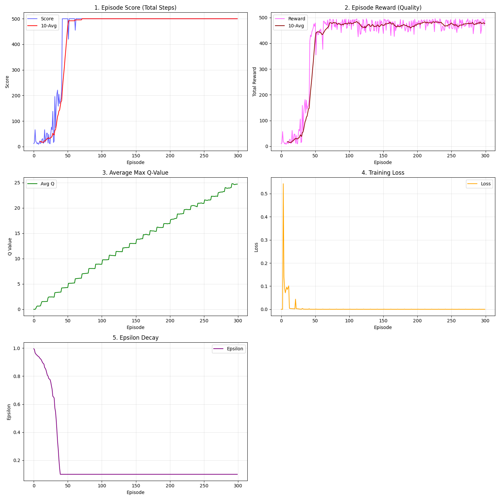
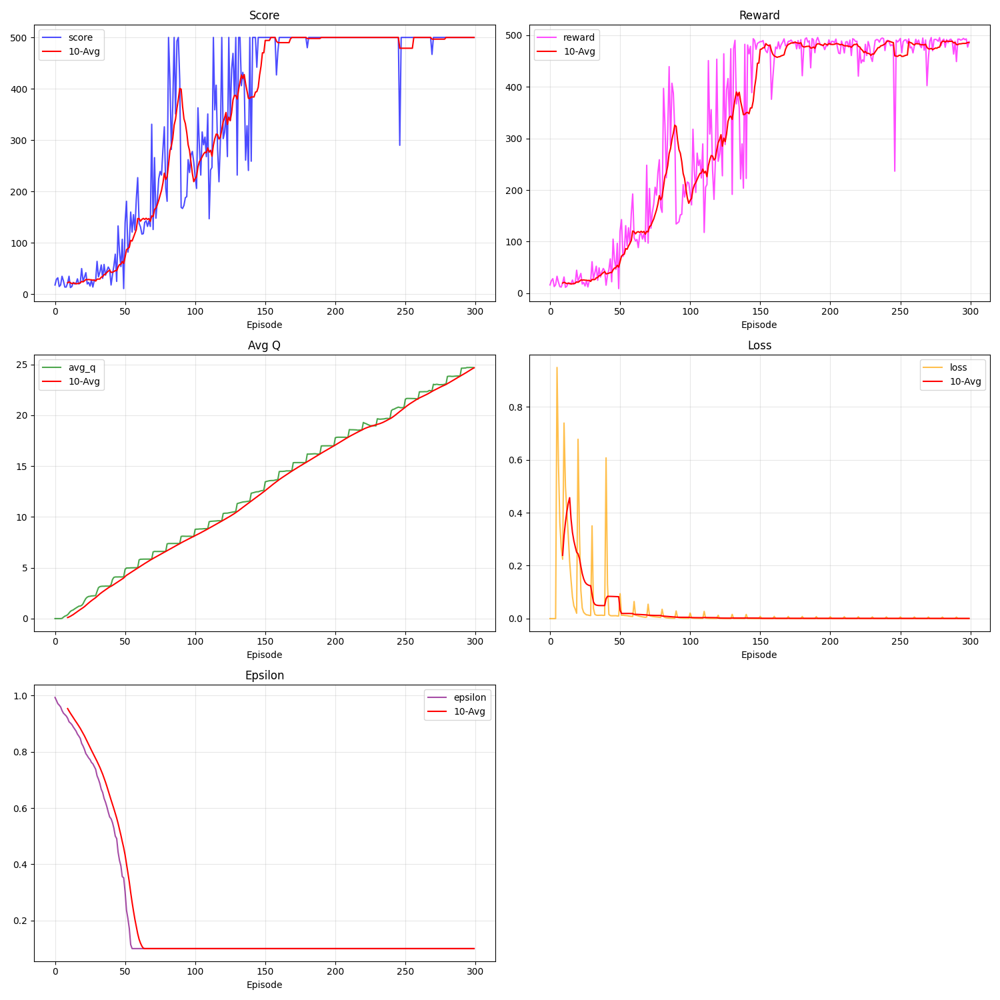

-----

# 📘 CartPole DQN / DDQN / Duel DQN Reinforcement Learning Project

## Overview

본 프로젝트는 **OpenAI Gym CartPole-v1** 환경에서 **DQN(Deep Q-Network)**, **DDQN(Double DQN)**, **Duel_DQN 알고리즘을 직접 구현하고, PyTorch를 기반으로 학습(Training) 및 시각화(Simulation)를 수행하는 강화학습 프로젝트입니다.

특히 **학습 환경(Docker)**과 **시뮬레이션 환경(Host venv)**을 완전히 분리하여 다음 세 가지를 모두 만족하도록 설계되었습니다.

1.  **안정적인 의존성 관리** (Environment Isolation)
2.  **GPU 기반의 고속 학습** (CUDA Support)
3.  **실시간 GUI 렌더링** (Real-time Visualization)

-----

## 📁 Project Structure

```text
CartPole-DQN-And-DDQN/
│
├── Train_DQN.py           # DQN 학습 코드
├── Train_DDQN.py          # DDQN 학습 코드
├── Train_Duel_DQN.py      # Dueling Double DQN 학습 코드
├── Run.py                 # 학습된 모델 시연 (Inference)
├── Model.py               # 신경망 구조 정의 (Network Architecture)
│
├── csv/                   # 학습 로그 CSV
├── image/                 # 학습 곡선 PNG
├── DQN/                   # DQN 모델 체크포인트
├── DDQN/             # DDQN 모델 체크포인트
├── Duel_DQN/            # Dueling Double DQN 모델 체크포인트
│
└── README.md
```

-----

## Architecture: 학습/시뮬레이션 환경 분리

본 프로젝트는 목적에 따라 두 가지 환경에서 동작합니다.

| 목적 | 환경 (Environment) | 실행 방식 | 주요 특징 |
| :--- | :--- | :--- | :--- |
| **Training** | 🐳 **Docker Container** | `docker run ...` | GPU 학습, 의존성 고정 (`gym==0.25.2`) |
| **Visualization** | 🖥️ **Host Python venv** | `source vis_env/bin/activate` | 실시간 렌더링, GUI 표시 (`gymnasium`) |

### 1. Simulation Environment (Host venv)

CartPole GUI 렌더링은 Docker 내부의 X11 제약을 피하기 위해 **Ubuntu Host의 Python virtualenv**에서 실행합니다.

  * **가상환경 활성화:**
    ```bash
    source vis_env/bin/activate
    ```
  * **주요 패키지:**
      * `gymnasium` (최신 렌더링 지원)
      * `torch`, `numpy`
      * `pygame` (렌더링 백엔드)
  * 이 환경에서는 학습된 `.pth` 모델을 로드하여 **실시간 게임 플레이**를 시연합니다.

### 2. Training Environment (Docker)

학습은 **Docker 컨테이너** 내부에서 수행하며, GPU를 안정적으로 사용합니다.

  * **컨테이너 실행 명령어:**
    ```bash
    docker run -it --gpus all \
      -v $(pwd)/CartPole-DQN-And-DDQN:/app \
      cartpole-dqn-env
    ```
  * **주요 패키지:**
      * `gym==0.25.2` (DQN/DDQN 코드 호환성 유지)
      * `numpy<2.0`
      * `PyTorch` (CUDA 지원)
      * `matplotlib`, `tqdm`
  * 모델이 저장되는 `/app/*.pth` 파일은 볼륨 마운트(`-v`)를 통해 **호스트 경로에도 자동 반영**됩니다.

-----

## Installation

### 1\. Clone Repository

```bash
git clone https://github.com/<your-id>/CartPole-DQN-And-DDQN.git
cd CartPole-DQN-And-DDQN
```

### 2\. Create Simulation venv (Host)

시각화를 위한 호스트 가상환경을 생성합니다.

```bash
python3 -m venv vis_env
source vis_env/bin/activate

pip install --upgrade pip
pip install torch gymnasium pygame numpy
```

### 3\. Build Docker Image (Training)

학습용 도커 이미지를 빌드합니다.

**Dockerfile Example:**

```dockerfile
FROM python:3.10-slim

RUN apt-get update && apt-get install -y python3-opengl

RUN pip install --upgrade pip
RUN pip install "numpy<2.0" gym==0.25.2 torch matplotlib tqdm

WORKDIR /app
CMD ["/bin/bash"]
```

**Build Command:**

```bash
docker build -t cartpole-dqn-env .
```

-----

## Training (in Docker)

학습은 도커 컨테이너 내부에서 진행합니다.

1.  **컨테이너 진입:**

    ```bash
    docker run -it --gpus all \
      -v $(pwd)/CartPole-DQN-And-DDQN:/app \
      cartpole-dqn-env
    ```

2.  **DQN 학습:**

    ```bash
    python Train_DQN.py
    # ➡ 생성 파일: dqn_cartpole.pth
    ```

3.  **DDQN 학습 (`Train_DDQN.py`):**

    ```bash
    python Train_DDQN.py
    # ➡ 로그: csv/ddqn_training_log.csv
    # ➡ 그래프: image/ddqn_training_result.png
    # ➡ 모델: "DDQN"/ddqn_cartpole_best.pth, "DDQN"/ddqn_cartpole_final.pth
    ```

4.  **Duel_DQN 학습 (`Train_Duel_DQN.py`):**

    ```bash
    python Train_DDQN.py
    # ➡ 로그: csv/ddqn_training_log.csv
    # ➡ 그래프: image/ddqn_training_result.png
    # ➡ 모델: "Duel_DQN"/ddqn_cartpole_best.pth, "Duel_DQN"/ddqn_cartpole_final.pth
    ```

-----

## Simulation (in Host)

학습된 모델을 눈으로 확인하기 위해 호스트 환경에서 실행합니다.

1.  **가상환경 활성화:**

    ```bash
    source vis_env/bin/activate
    ```

2.  **DQN 시연, DDQN 시연:**

    ```bash
    python Run.py
    ```

-----

## Model Files

| 파일명 | 설명 | 비고 |
| :--- | :--- | :--- |
| `DQN/dqn_cartpole_final.pth` | DQN 학습 최종 모델 | |
| `DQN/dqn_cartpole_best.pth` | DQN 최고 성능 모델 | 테스트 리워드 최고 기록 시 저장 |
| `DDQN/ddqn_cartpole_final.pth` | DDQN 학습 최종 모델 | |
| `DDQN/ddqn_cartpole_best.pth` | DDQN 최고 성능 모델 | 테스트 리워드 최고 기록 시 저장 |
| `Duel_DQN/duel_dqn_cartpole_final.pth` | Duel_DQN 학습 최종 모델 | |
| `Duel_DQN/duel_dqn_cartpole_best.pth` | Duel_DQN 최고 성능 모델 | 테스트 리워드 최고 기록 시 저장 |

-----

## Training Results

- **DQN 학습 곡선**  
  

- **DDQN 학습 곡선**  
  

- **DDQN 학습 곡선**  
  
